<a name="top"></a>

<div align="center">



<br />

<a href="https://github.com/Hacking-Notes/VulnScan/stargazers"></a>
<a href="https://github.com/Hacking-Notes/VulnScan/network/members"></a>
<a href="https://github.com/Hacking-Notes/VulnScan/commits"></a>
<a href="LICENSE"></a>
<a href="https://hacking-notes.com"></a>

</div>

<br />


Introducing VulnScan - the ultimate vulnerability scanning tool that'll make hackers cry and website owners rejoice! Say goodbye to pesky security breaches and hello to peace of mind.

VulnScan is a powerful vulnerability scanning tool designed to help website owners protect their websites from cyber threats. It uses cutting-edge technology that leverages ChatGPT, an AI language model trained by OpenAI, to verify the JavaScript of your website and search for vulnerabilities. With vulnScan, you can detect security vulnerabilities and fix them before they can be exploited by cybercriminals.

<b>Just a heads up: This tool utilise ChatGPT (Turbo 3.5)</b> ---> <b>Get your API Key <a href="https://platform.openai.com/account/api-keys">Here</a></b>

## Commands

<b>Using OpenAI API</b>
```
git clone https://github.com/Hacking-Notes/VulnScan.git       ---> Download the files

pip install -r requirements.txt                               ---> Install requirements
```
Launch the script
```
python3 VulnScan.py                                           ---> Launch the script
```


## Development

In terms of future development, vulnScan has several features in the pipeline that will make it even more powerful and useful for website owners. These include:

<ul style="list-style-type:disc;">
  <li>Change UI</li>
  <li>Modify the requirements.txt file by removing any packages that are not being used.</li>
  <li>Add option to bring your own list of URL's</li>
  <li>Implement the URL's search function</li>
  <li>Add the ability to detect SQL vulnerabilities.</li>
  <li>Add the ability to detect CSRF vulnerabilities.</li>
  <li>...</li>
</ul> 

VulnScan will enhance its versatility and customization with the introduction of new features, which will aid website owners and bug bounty hunters in identifying threats more easily and efficiently.


## Demo

https://user-images.githubusercontent.com/118412415/221425598-136810fe-d3bc-47cb-a253-a25a4639d43b.mp4


## Disclaimer

The tool provided on this GitHub page is intended for educational and research purposes only. The creators and maintainers of this tool are not responsible for any misuse or illegal use of the tool. It is the responsibility of the users to ensure that they comply with all applicable laws and regulations while using the tool.


## 🧰 Hacking Notes Ecosystem

<div align="center">

🌐 &nbsp;**[hacking-notes.com](https://hacking-notes.com)** &nbsp;·&nbsp; ✍️ &nbsp;**[blog](https://hacking-notes.medium.com/)** &nbsp;·&nbsp; 💬 &nbsp;**[discord](https://discord.gg/r68ameNHrD)**

</div>

| | Resource | What you get |
| :-: | -------- | ------------ |
| 🗺 | **[Hacker-Roadmap](https://github.com/Hacking-Notes/Hacker-Roadmap)** | Structured paths from beginner to pro — hobbyist, bug bounty, certs & degree. |
| 🔴 | **[RedTeam Notes](https://github.com/Hacking-Notes/RedTeam)** | Offensive security notes: recon, exploitation, Windows & Linux. |
| 🔷 | **[BlueTeam Notes](https://github.com/Hacking-Notes/BlueTeam)** | Defensive security notes: forensics, malware, log & packet analysis. |
| 🧩 | **[Extensions](https://github.com/Hacking-Notes/Extensions)** | Curated Chrome extensions for ethical hacking & recon. |
| 🔖 | **[Bookmarks](https://github.com/Hacking-Notes/Bookmarks)** | Curated hacker bookmark collection, one import away. |


<div align="right"><a href="#top">⬆ back to top</a></div>
